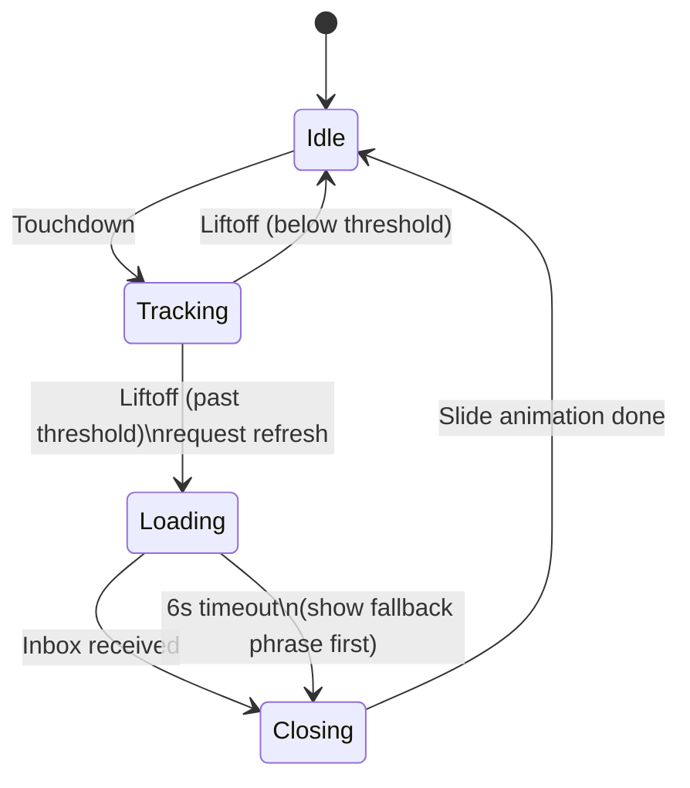

# Pull-to-Refresh Sheet — Implementation Plan

## Goal

Replace the silent pull-down-to-refresh gesture with a visible sheet that follows the finger, runs a loading animation with cycling phrases while waiting for data, then slides back up when the refresh completes (or times out).

## User-facing behavior



- **Pulling**: sheet rubber-bands down 1:1 with finger from y=0. A subtle "PULL TO REFRESH" hint appears below threshold; past threshold the hint changes to "RELEASE TO REFRESH" and the indicator color shifts.
- **Released past threshold**: sheet snaps fully open (covers the card), shows animated indicator + a phrase from the rotation, fires `comm_request_refresh()`.
- **Phrase rotation**: cycles every 1.5s while loading. On timeout (6s), switches to fallback phrase "Couldn't reach the sky..." then closes after ~1.5s.
- **On data received**: sheet slides back up (reverse direction), revealing the now-updated card. Existing bottom "UPDATED NOW" pill picks up from there.
- **Released below threshold**: sheet rubber-bands back up, no refresh.
- **Locked-out inputs while sheet is open or animating**: horizontal swipes, UP/DOWN/SELECT buttons all ignored.
- **Works on every card.**

## Visual design

Full-screen sheet using `theme_bg()` that slides down from y=0. Centered content stack:

- An animated loading indicator (rotating arc / pulsing dots) at the top third
- Below it, the cycling phrase in `GOTHIC_24_BOLD`, centered, with `GTextOverflowModeWordWrap`

While pulling (before release), only the indicator appears, scaled by pull-progress, and a small hint text ("PULL TO REFRESH" → "RELEASE TO REFRESH").

Phrase list (initial set, easy to extend):

- "Consulting the sky..."
- "Time will tell..."
- "Asking the clouds..."
- "Reading the wind..."
- "Checking the horizon..."
- "Listening for thunder..."
- "Tracking the sun..."

Fallback on timeout: "Couldn't reach the sky..."

## Architecture

### New module: `src/c/refresh_sheet.{h,c}`

Owns all sheet state and rendering. Public API:

```c
typedef enum {
  REFRESH_IDLE,
  REFRESH_TRACKING,   // finger down, sheet following finger
  REFRESH_LOADING,    // sheet open, waiting on inbox
  REFRESH_CLOSING,    // sliding back up
} RefreshState;

void refresh_sheet_init(Window *window);
void refresh_sheet_deinit(void);

// Touch handler hooks. Return true if the sheet consumed the event.
bool refresh_sheet_on_touchdown(int16_t x, int16_t y);
bool refresh_sheet_on_move(int16_t x, int16_t y);
bool refresh_sheet_on_liftoff(int16_t x, int16_t y);

// Called by comm.c when fresh inbox data lands.
void refresh_sheet_on_data_received(void);

// True while sheet is non-idle. Used to gate buttons + nav.
bool refresh_sheet_is_active(void);
```

Internally owns:

- A `Layer*` overlaid above the nav layers, with `clips=true`. Update proc draws the sheet at its current `y_offset` (0 = fully hidden above screen, full height = fully open).
- An `AppTimer` for the open/close slide (eased, 250ms).
- An `AppTimer` for phrase rotation (1500ms repeating while loading).
- An `AppTimer` for the 6s loading safety timeout.
- Current phrase index + RNG-picked starting offset per pull.

### Touch handler wiring in `TouchWeather.c`

The existing `touch_handler` gets restructured to:

1. On `Touchdown`: call `refresh_sheet_on_touchdown()`. If sheet is already non-idle, return early (input lock-out).
2. On `Move`: subscribe to it (currently unhandled). Pass to `refresh_sheet_on_move()` which updates pull progress while `state==TRACKING`.
3. On `Liftoff`: call `refresh_sheet_on_liftoff()` first; if it returns `true`, skip the swipe/tap fallthrough.

Heuristic for "this is a pull-down": within the first ~10px of movement, if `dy > 0` and `dy > |dx|`, the sheet claims the gesture; otherwise the existing horizontal/tap logic runs as before. This keeps horizontal swipes and taps undisturbed.

### Button lock-out

`prv_select_click`, `prv_up_click`, `prv_down_click` add an early-return when `refresh_sheet_is_active()`.

### Comm hook

`prv_inbox_received` in `comm.c` already calls `s_update_cb` (= `nav_redraw`). Add a call to `refresh_sheet_on_data_received()` at the same point. The sheet function is a no-op when state is IDLE, so this is safe to call on every successful inbox.

### Loading indicator rendering

Reuse the existing 10 Hz `anim_get_frame()` from `anim.c`. The sheet's update proc uses the frame to advance the animated indicator. Extend the `needs_redraw` check in `anim.c`'s `prv_tick` with `|| refresh_sheet_is_active()` so the sheet keeps animating even on cards that don't normally trigger redraws.

The indicator itself: rotating circular-arc style (3 dots orbiting a center, or a single rotating arc). Drawn with primitives. ~30 lines.

### Slide animation

When opening: timer-driven 250ms ease-out. Same approach used in `nav.c` for card transitions. When closing: 250ms ease-in.

### Pull threshold

`PULL_FULL_THRESHOLD = 60` (matches today's `PULLDOWN_THRESHOLD`). Visual progress: 0..1 = `min(1, dy / 60)`. Below 0.5 → label = "PULL TO REFRESH". At >= 1.0, label = "RELEASE TO REFRESH" and indicator color brightens.

### Round display

On gabbro the sheet is the same full-screen overlay; content is centered, so the bezel mask is fine. The pull threshold and indicator size stay unchanged.

## File-by-file changes

| File | Change |
|---|---|
| `src/c/refresh_sheet.h` | New. Public API above. |
| `src/c/refresh_sheet.c` | New. ~250 lines. Sheet layer, state machine, timers, phrase list, indicator drawing. |
| `src/c/TouchWeather.c` | Add `TouchEvent_Move` handling; route all 3 events through `refresh_sheet_on_*`. Add `refresh_sheet_is_active()` guard at top of `prv_select_click/up/down`. Init/deinit calls. Remove the inline `comm_request_refresh()` on liftoff (sheet owns it now). |
| `src/c/comm.c` | One-line add: call `refresh_sheet_on_data_received()` whenever `got_anything` is true (alongside `s_update_cb`). |
| `src/c/anim.c` | Extend `needs_redraw` to include `refresh_sheet_is_active()`. |
| `wscript` | New `.c` file is auto-picked up if wscript globs `src/c/**/*.c`; verify. |

## Edge cases handled

- **Already loading, user pulls again**: ignored (touchdown returns early when state != IDLE).
- **Refresh callback fires before sheet finishes opening**: state stays LOADING until min display time (~1s) so the sheet doesn't flash open-and-close, then closes.
- **Timeout**: at 6s, swap to fallback phrase, hold ~1.5s, close.
- **App backgrounded mid-refresh**: `refresh_sheet_deinit()` cancels timers, restores state.
- **Touch service unavailable** (older firmware): `ENABLE_TOUCH=0` path means the sheet code is dead weight; already gated.
- **Theme switch while sheet open**: sheet uses `theme_bg()/theme_fg()` at draw time, so it re-themes naturally.

## Testing approach

Per `CLAUDE.md`:

1. Build for emery: `pebble build`
2. Install on emery emulator: `pebble install --emulator emery`
3. Visual verify states with screenshots: idle, mid-pull, fully open with phrase, transitioning back up.
4. Verify SELECT/UP/DOWN are no-ops while sheet is loading.

Note: programmatic touch input from the CLI is limited; live finger-follow may need manual testing in the emulator GUI. We'll rely on screenshots to verify the rendered states (open sheet with phrase) and on logic review for the gesture path.

## What does NOT change

- Bottom "UPDATED Xm AGO" pill behavior.
- Card layouts.
- Horizontal swipe nav, taps, button handlers (only gated, not redesigned).
- Communication protocol with PKJS.