# ClickyWeather ⌚🌦️  
**Weather, but with attitude. Built for button-first Pebbles.**

ClickyWeather is a playful, card-based weather app for Pebble that mixes useful forecast data with personality.  
It's designed around quick button presses, quick glances, and weather advice that can be practical, sarcastic, and occasionally unreasonably honest.

## 🌟 Why this app is different
### **Focused weather UX** on Pebble  
### **Built only for `gabbro` and `emery`**  

ClickyWeather is a fork of [TouchyWeather](https://github.com/ClickCalickClick/TouchyWeather) by ClickCalickClick,
reimagined around button-based navigation. If you prefer navigating with hardware buttons over touch, this one's for you.

Most Pebble weather apps are bare-bones. ClickyWeather is built around fast card navigation, pull-down refresh,
and a personality engine that actually has something to say.

### Changes from TouchyWeather

- **Navigation animations** — Reworked to reflect vertical up/down button navigation instead of horizontal swipe transitions
- **Radar and Touch & Go card removed** — Dropped in favour of keeping the app lean and card-focused
- **Settings moved** — Relocated from an in-app card to the Pebble companion app for a cleaner card flow

---

## Feature Overview

ClickyWeather is a carousel of focused weather cards:

- **Main** — current temp, feels-like, high/low, wind, humidity, quick status
- **6 Hours** — next 6-hour outlook
- **Week Ahead** — 4-day forecast snapshot
- **Precipitation** — near-term rain probability view
- **UV** — UV index + risk context
- **Air Quality** — AQI + air quality signal
- **Sun Cycle** — sunrise/sunset timing
- **Night Sky** — moon phase + illumination
- **Golden Hour** — blue/golden hour timing blocks
- **Alerts** — active weather alerts by severity with color-coded categories

---

## Screenshots

Each card is shown on both **emery** (rectangular) and **gabbro** (round). Use UP/DOWN to move between cards.

<table>
  <tr>
    <th>emery</th>
    <th>gabbro</th>
    <th>Description</th>
  </tr>
  <tr>
    <td>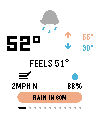</td>
    <td>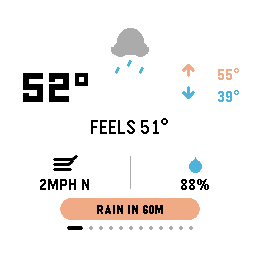</td>
    <td><strong>Main</strong><br>At-a-glance current conditions: temperature, feels-like, high/low, wind speed &amp; direction, humidity, and a bottom banner showing the next precipitation event.</td>
  </tr>
  <tr>
    <td>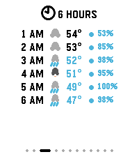</td>
    <td>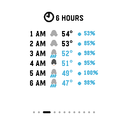</td>
    <td><strong>6 Hours</strong><br>Hour-by-hour outlook for the next six hours: time, weather icon, temperature, and precipitation probability — useful for planning the next few hours of your day.</td>
  </tr>
  <tr>
    <td>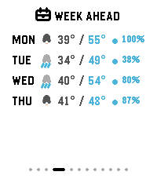</td>
    <td>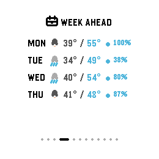</td>
    <td><strong>Week Ahead</strong><br>Four-day forecast snapshot showing day name, condition icon, high/low temperatures, and rain probability for each day.</td>
  </tr>
  <tr>
    <td>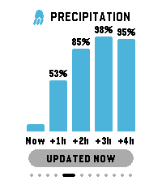</td>
    <td>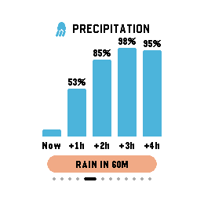</td>
    <td><strong>Precipitation</strong><br>Bar chart of near-term rain probability across the next several hours (Now → +4h), giving a visual sense of how quickly rain is arriving or clearing.</td>
  </tr>
  <tr>
    <td>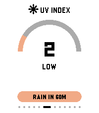</td>
    <td>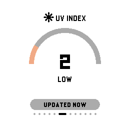</td>
    <td><strong>UV Index</strong><br>Gauge-style dial showing the current UV index value and risk label (Low / Moderate / High / etc.). Helps you decide whether sunscreen is optional or mandatory.</td>
  </tr>
  <tr>
    <td>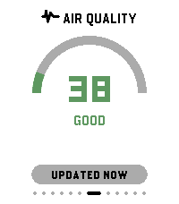</td>
    <td>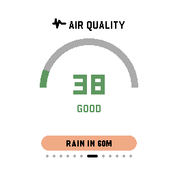</td>
    <td><strong>Air Quality</strong><br>Gauge-style AQI reading with a descriptive label (Good / Moderate / Unhealthy / etc.). Useful for runners and anyone sensitive to air pollution.</td>
  </tr>
  <tr>
    <td>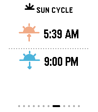</td>
    <td>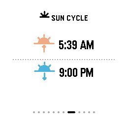</td>
    <td><strong>Sun Cycle</strong><br>Sunrise and sunset times for your location, displayed with distinct up/down icons so you can plan outdoor activities around available daylight.</td>
  </tr>
  <tr>
    <td>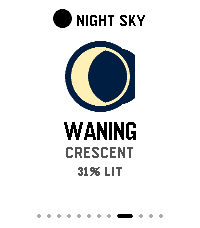</td>
    <td>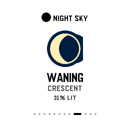</td>
    <td><strong>Night Sky</strong><br>Current moon phase name and illumination percentage, rendered with a large moon-phase illustration. Handy for stargazers or anyone curious about tonight's sky.</td>
  </tr>
  <tr>
     <td>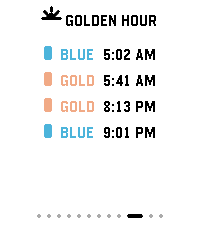</td>
     <td>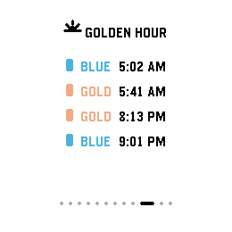</td>
     <td><strong>Golden Hour</strong><br>Blue-hour and golden-hour start times for both morning and evening, colour-coded in blue and gold. Perfect for photographers chasing the best light.</td>
   </tr>
  <tr>
     <td></td>
     <td></td>
     <td><strong>Alerts</strong><br>Weather alerts for your region, color-coded by severity (red for tornadoes, orange for wind/heat, blue for flood, etc.). Shows "ALL CLEAR" when no alerts are active. Displays "NO DATA" if the region isn't covered by an alert source.</td>
   </tr>
 </table>

---

## Customizing Your Cards

ClickyWeather lets you customize which cards appear on your watch through the **phone app settings**.

Open the phone app's configuration page and navigate to the **Cards** section. Toggle any of the 9 optional cards on or off to build your ideal weather deck:

- **6 Hours**, **Week Ahead**, **Precipitation**, **UV Index**, **Air Quality**, **Sun Cycle**, **Night Sky**, **Golden Hour**, **Alerts**

Your choices sync to the watch immediately. This means you can run ultra-minimal (just core weather) or full nerd mode (everything enabled).

**Note:** The **Main** card is always enabled and cannot be disabled—it's your anchor weather view.

---

## Controls

- **UP/DOWN**: previous/next card
- **Pull down**: manual weather refresh
- **SELECT**: toggle light/dark theme

---

## Platform Support

ClickyWeather targets only:

- `emery`
- `gabbro`

No legacy non-touch Pebble targets are included.

---

## Build / Run

```bash
pebble build
```

Install to emulator (headless-friendly):

```bash
pebble install --emulator emery --vnc
```

Take a screenshot:

```bash
pebble screenshot --emulator emery --vnc --no-open screenshot.png
```

---

## Open Source

ClickyWeather is open source in this repository.  
Feel free to explore, fork, tweak card behavior, expand phrases, and make it even more delightfully extra.
