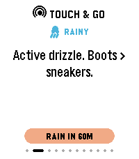
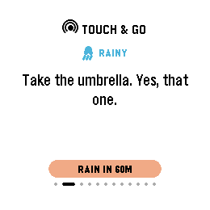
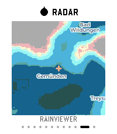
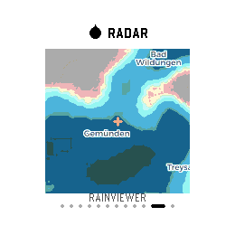
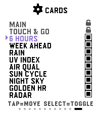
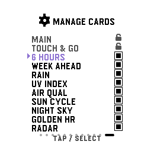

# TouchyWeather ⌚🌦️  
**Weather, but with attitude. Built for touch-first Pebbles.**

TouchyWeather is a playful, card-based weather app for Pebble that mixes useful forecast data with personality.  
It’s designed around fast swipes, quick glances, and weather advice that can be practical, sarcastic, and occasionally unreasonably honest.

<div align="center">

## 🌟 Why this app is different
### **Touchscreen-first weather UX** on Pebble  
### **Built only for `gabbro` and `emery`**  

Most Pebble weather apps are button-first. TouchyWeather is built around touch interactions from day one:
**swipe left/right to move cards, pull down to refresh, tap to move Settings cursor**.

</div>

---

## Feature Overview

TouchyWeather is a carousel of focused weather cards:

- **Main** — current temp, feels-like, high/low, wind, humidity, quick status
- **Touch & Go** — dynamic weather guidance with humor/sarcasm
- **6 Hours** — next 6-hour outlook
- **Week Ahead** — 4-day forecast snapshot
- **Precipitation** — near-term rain probability view
- **UV** — UV index + risk context
- **Air Quality** — AQI + air quality signal
- **Sun Cycle** — sunrise/sunset timing
- **Night Sky** — moon phase + illumination
- **Golden Hour** — blue/golden hour timing blocks
- **Radar** — streamed radar image card with location crosshair
- **Settings** — enable/disable cards to build your own weather flow

---

## Screenshots

Each card is shown on both **emery** (rectangular) and **gabbro** (round). Swipe left/right to move between cards.

<table>
  <tr>
    <th>emery</th>
    <th>gabbro</th>
    <th>Description</th>
  </tr>
  <tr>
    <td></td>
    <td></td>
    <td><strong>Main</strong><br>At-a-glance current conditions: temperature, feels-like, high/low, wind speed &amp; direction, humidity, and a bottom banner showing the next precipitation event.</td>
  </tr>
  <tr>
    <td></td>
    <td></td>
    <td><strong>Touch &amp; Go</strong><br>The personality engine. Classifies live conditions and delivers a witty or practical one-liner — "Active drizzle. Boots &gt; sneakers." It also echoes the next precipitation banner so you never lose context.</td>
  </tr>
  <tr>
    <td></td>
    <td></td>
    <td><strong>6 Hours</strong><br>Hour-by-hour outlook for the next six hours: time, weather icon, temperature, and precipitation probability — useful for planning the next few hours of your day.</td>
  </tr>
  <tr>
    <td></td>
    <td></td>
    <td><strong>Week Ahead</strong><br>Four-day forecast snapshot showing day name, condition icon, high/low temperatures, and rain probability for each day.</td>
  </tr>
  <tr>
    <td></td>
    <td></td>
    <td><strong>Precipitation</strong><br>Bar chart of near-term rain probability across the next several hours (Now → +4h), giving a visual sense of how quickly rain is arriving or clearing.</td>
  </tr>
  <tr>
    <td></td>
    <td></td>
    <td><strong>UV Index</strong><br>Gauge-style dial showing the current UV index value and risk label (Low / Moderate / High / etc.). Helps you decide whether sunscreen is optional or mandatory.</td>
  </tr>
  <tr>
    <td></td>
    <td></td>
    <td><strong>Air Quality</strong><br>Gauge-style AQI reading with a descriptive label (Good / Moderate / Unhealthy / etc.). Useful for runners and anyone sensitive to air pollution.</td>
  </tr>
  <tr>
    <td></td>
    <td></td>
    <td><strong>Sun Cycle</strong><br>Sunrise and sunset times for your location, displayed with distinct up/down icons so you can plan outdoor activities around available daylight.</td>
  </tr>
  <tr>
    <td></td>
    <td></td>
    <td><strong>Night Sky</strong><br>Current moon phase name and illumination percentage, rendered with a large moon-phase illustration. Handy for stargazers or anyone curious about tonight's sky.</td>
  </tr>
  <tr>
    <td></td>
    <td></td>
    <td><strong>Golden Hour</strong><br>Blue-hour and golden-hour start times for both morning and evening, colour-coded in blue and gold. Perfect for photographers chasing the best light.</td>
  </tr>
  <tr>
    <td></td>
    <td></td>
    <td><strong>Radar</strong><br>Streamed precipitation radar image rendered directly on the watch, with a crosshair centred on your location and RainViewer attribution. Press <strong>SELECT</strong> to force a refresh.</td>
  </tr>
  <tr>
    <td></td>
    <td></td>
    <td><strong>Settings — Manage Cards</strong><br>Toggle any card on or off to build your ideal weather deck. Main and Touch &amp; Go are always enabled; everything else is optional. Tap to move the cursor, SELECT to toggle.</td>
  </tr>
</table>

---

## Radar: Highlight Feature

The Radar card streams a watch-optimized image from the radar proxy and renders it directly on-watch, including:

- loading/progress states
- error handling/retry
- center crosshair over your location
- RainViewer attribution

You can force a radar refresh with **SELECT** while on the Radar card.

---

## Settings Card: Your Deck, Your Rules

TouchyWeather includes an in-app **Manage Cards** screen where you can enable/disable cards anytime.  
`MAIN` and `TOUCH & GO` stay locked on (always available), while other cards can be toggled on/off.

This means you can run ultra-minimal (just core weather) or full nerd mode (everything enabled).

---

## Touch & Go (the personality engine)

Touch & Go classifies live conditions into tiers (storm, rain soon, hot, high UV, bad air, pleasant, etc.) and picks a fitting line.

Examples from the app’s phrase pools:

- “**Lightning out. Stay in. Don't be a conductor.**”
- “**Hydrate or wilt.**”
- “**Hair plans? Cancelled.**”
- “**Sunscreen isn't optional.**”
- “**Boring weather. The good kind.**”

It’s meant to feel like your weather app has opinions.

---

## Controls

- **Swipe left/right**: previous/next card
- **Pull down**: manual weather refresh
- **Tap (on Settings card)**: move settings cursor
- **SELECT (Settings)**: toggle highlighted card on/off
- **SELECT (Radar)**: force radar refresh
- **SELECT (other cards)**: toggle light/dark theme

Buttons still work too (`UP`/`DOWN` for navigation), but touch is the star.

---

## Platform Support

TouchyWeather targets only:

- `emery`
- `gabbro`

No legacy non-touch Pebble targets are included.

---

## Build / Run

```bash
pebble build
```

Install to emulator (headless-friendly):

```bash
pebble install --emulator emery --vnc
```

Take a screenshot:

```bash
pebble screenshot --emulator emery --vnc --no-open screenshot.png
```

---

## License


TERMS OF USE: CREATIVE COMMONS ATTRIBUTION-NONCOMMERCIAL 4.0 WITH ADDENDUM

This software is licensed under the Creative Commons Attribution-NonCommercial 
4.0 International License (CC BY-NC 4.0), supplemented by the specific platform 
distribution restrictions detailed in the Addendum below.

To view a full copy of the standard CC BY-NC 4.0 license, visit:
https://creativecommons.org/licenses/by-nc/4.0/legalcode

------------------------------------------------------------------------------
SUMMARY OF STANDARD PERMISSIONS (CC BY-NC 4.0)
------------------------------------------------------------------------------
Under the standard terms of this license, you are free to:
  * Share — copy and redistribute the material in any medium or format.
  * Adapt — remix, transform, and build upon the material.

Under the following conditions:
  * Attribution — You must give appropriate credit, provide a link to the 
    license, and indicate if changes were made.
  * Non-Commercial — You may not use the material for commercial purposes or 
    monetary compensation.

------------------------------------------------------------------------------
ADDENDUM: SPECIFIC MARKETPLACE DISTRIBUTION RESTRICTIONS
------------------------------------------------------------------------------
In addition to the standard terms of the CC BY-NC 4.0 license, the Copyright 
Holder places the following binding restriction on public distribution:

1. Marketplace Exclusivity: Permission is expressly denied to publish, host, 
   or distribute this software, its binaries, or any substantially derived 
   works (including look-alike clones or functional duplicates) as a standalone 
   listing within the Pebble App Store (or its official community successor 
   distribution platforms) without the prior written consent of the original 
   Copyright Holder.

2. Permitted Collaboration: Modification and distribution of the source code 
   via public forks on platforms such as GitHub are fully permitted and 
   encouraged, provided that any marketplace-facing feature enhancements or 
   bug fixes are submitted as contributions (Pull Requests) to the upstream 
   repository for integration into the primary application listing.


Copyright (c) 2026 ClickCalickClick. All rights reserved.

